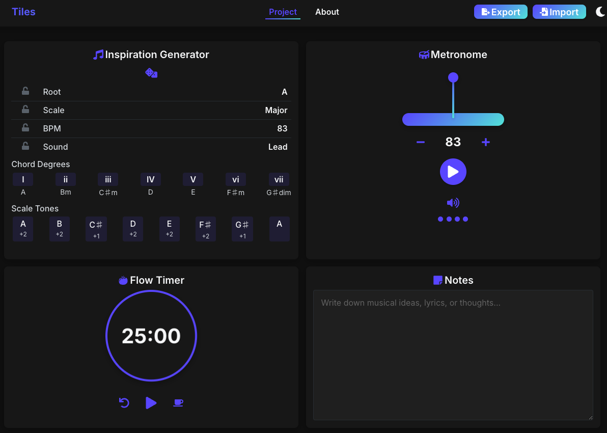

# Tiles — Tools for Creative Flow

A simple set of tools to help musicians stay creative and focused.

## Live Version

Check out the [live version](https://fxcircus.github.io/music-tools-studio) on GitHub pages or follow the [Local Installation](#local-installation) instructions



## Features

- **⏲️ Flow Timer:** A Pomodoro-style timer to help you stay focused while writing, practicing, or producing.

- **🎲 Inspiration Generator:** Randomize scales, BPM, and sounds. Lock in what you like and shuffle the rest.

- **🎶 Metronome:** A smooth, visual metronome with BPM controls to keep you in perfect time.

- **📝 Notes:** Capture lyrics, chord progressions, FX pedal settings, etc'...

- **💾 Save Your Work:** Export your project settings and notes to continue later or share with collaborators. Import previously saved projects with a single click.

- **🌓 Dark / Light Modes:** Yes.

## Technologies Used

- **⚛️ React + TypeScript**
- **🎵 Tone.js** for metronome audio engine
- **🔀 Framer Motion** for fluid animations 
- **🔊 Web Audio API**
- **📦 Node.js**

## Local Installation

```
git clone https://github.com/fxcircus/music-tools-studio.git
cd music-tools-studio
npm install
npm start
```

The app will run in development mode at [http://localhost:3000](http://localhost:3000).

## Debug Mode 🐞

The application includes a debug mode that can be enabled for development and troubleshooting:

1. Open `src/config.ts`
2. Set `DEBUG_MODE: true`
3. Reload the application

When debug mode is enabled, a debug button will appear in the Metronome component, allowing you to view detailed logs about the metronome's operation.